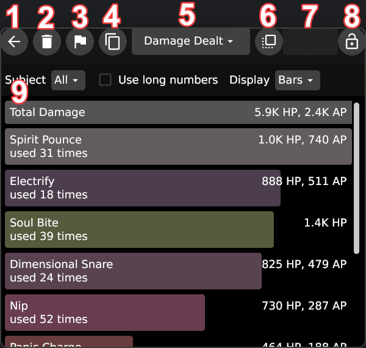

# PG Combat Tracker
#### Sophisticated Project Gorgon combat log tracker for all your statistical needs!

## Screenshots
     

## Features
- **Tracks all the skills you use and damage dealt**
- **Tracks all the enemies and enemy types that damaged you**
- **Tracks all the times you or your enemies heal**
- **Tracks your XP gains**
- **Tracks misc stats that don't fit on any other tab**
- **Tracks data for pets and summonable entities too!**
- **Pie charts!**
- **Area graphs!**
- **Time marker system for you to mark your important events**
- **Image based reports for easy sharing!**
- **Ability to export chat log with markers included**
- **Themes!**
- **Not a web browser!** (Made with GioUI immediate mode UI library)

## How To Run
1. Download [latest release](https://github.com/TheJebForge/PGCombatTracker/releases/latest) for your OS (.exe for Windows, no extension file for Linux)
2. **On Linux Only** Set the file permission as executable (On KDE, right click > Properties > Permissions > Is Executable)
3. Run the executable
4. Optionally find Project Gorgon's `ChatLogs` folder if prompted


## How To Use

### VIP subscription for Project Gorgon is required for ChatLogs to contain Combat lines
Enable `Save Chat Logs` in the game as shown on the screenshot:

Set your `Combat Logging` as shown:


You can disable things you don't want to see in the software, if you want

### File Selection Screen

1. Refreshes the file list
2. Opens the Browse dialog
   - You can use it to pick any other chat log file, or files that were shared with `Export File With Markers` feature
3. Opens Settings screen
4. Opens specified file and navigates to Marker Selection screen

### Marker Selection Screen

1. Navigates back to File Selection screen
2. List of markers found in the file
    - Clicking on markers will tell the software to load data from time of the marker to time of the next marker
      - Selecting `2025-01-10 11:24:20` marker for instance, will load data from `2025-01-10 11:24:20` until `2025-01-10 11:28:14`
    - Multiple markers can be selected at once, which allows you to load only what you want to see
    - If no markers are selected, the software will just load everything found in the file
3. Tells the software if it should keep trying to read from the file
    - Whenever the game creates a new chat line, it would write that to ChatLogs file. Having that checkbox checked will make the software keep checking for changes and load new data as it appears
    - **Don't use this feature on old files** as the software would attempt to simulate ticks that happened from start of the time to current time
      - Ticking system is used to update DPS calculators
4. File load mode, tells the software how the file should be loaded
    - Use selected markers, will load data for specified markers as explained for #2, or the entire file if no markers are selected
    - Just load everything, will load all data found in the file
    - Use custom time frame, will load data in range specified below
5. Custom time frame fields, lets you specify exact time frame for the software to use
    - Start with user field should be specified with name of your character, not having it specified will force the software to figure it out on its own
      - The software will not know your character name until it finds a `Logged In` line in chat log or you used a skill
6. Exports currently open file with all the custom markers that were created in Statistics screen
7. Navigates to Statistics screen for the currently open file

### Statistics Screen

1. Navigates back to Marker Selection screen
2. Resets currently collected data
    - Useful if you want to clear the data and only see statistics for your new actions in the game
3. Opens Marker Creation dialog

   
   - You can specify a name for your marker, or not. If name is not specified, it will be saved as "Unnamed"
   - After clicking `Confirm`, a new marker will be found on Marker Selection screen for current time
   - Useful if you want to leave markers before and after a dungeon, so you can then check your statistics for that dungeon only
4. Copies current tab's contents with current settings into clipboard
   - You can use that to quickly share your statistics with other people on Discord for example
5. Tab selection dropdown, you can use it to go to other statistics collected by the software
6. Window grab area (works on Windows only), you can use it to move the window around
7. Window grab lock (also Windows only), it disables previously mentioned grab area, so you can't accidentally move the window
8. Current tab's contents, displays all the statistics found on current tab
   - You can use controls found in this area to change settings of current tab

### Graph Controls
#### Overview Mode
Lets you see the entire range of the data

1. Time selection area, you can use this control to decide timeframe of displayed data in the graphs
    - Clicking and dragging the handles on the sides of the selection lets you adjust their position in time
    - Clicking and dragging the selection area lets you move current selection along the timeline
    - Clicking and dragging outside of the selection area lets you select a new timeframe
    - Clicking inside or outside the selection area moves the closest handle to the cursor
2. Time selection mode, clicking on this will switch current mode
   - Currently visible chart icon points out that the time selection is currently in Overview Mode
#### Realtime Mode
Automatically adjusts range of the data to be most current

1. Look back time buttons, decides the time offset the software will use to display the data
    - Only useful when you're looking at a file that's still being updated by the game
    - Lets you see the data as it arrives into the software
2. Time selection mode, clicking on this will switch current mode
   - Currently visible time icon points out that the time selection is currently in Realtime Mode

### Settings Screen

1. Changes color theme of the software
2. Tick interval setting
    - DPS calculators use ticks to keep updating their data, this setting will change how frequently they will update
3. Seconds until DPS calculators would reset their value
    - Determines how long DPS calculators would "keep their tail"
4. If levels should be removed from skill names
    - Usually most skills in Project Gorgon would end in their level number
    - You can disable this if you want to see damage you did for separate skill's levels
5. List of entity names that will be considered as pets
    - This will determine if an entity will have its damage dealt, damage taken tracked
    - The software would check if entity's name contains any of the following names
    - Names specified here are not case sensitive

## How To Build
If for whatever reason, you want to build this project yourself

This project requires Go version 1.23+

#### Windows
- Install gogio tool
```shell
go install gioui.org/cmd/gogio@latest
```
- Build the executable
```shell
GOOS=windows GOARCH=amd64 gogio -buildmode=exe -icon=pgcticon.png -arch=amd64 -target=windows -o PGCombatTracker.exe ../PGCombatTracker
```

#### Linux
Some dependencies are required to build this project

Build requirements for Ubuntu:
```shell
sudo apt install build-essential libwayland-dev libxkbcommon-dev libgtk-3-dev libvulkan-dev libxkbcommon-x11-dev libx11-xcb-dev 
```
You would have to find equivalent packages for your Linux distribution

You can then just
```shell
go build -o PGCombatTracker
```
